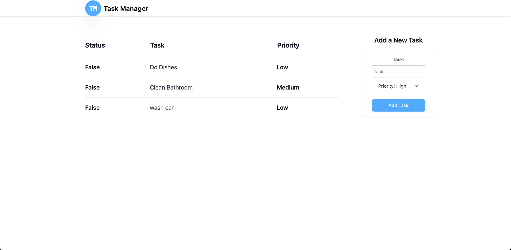

# Todo Mern Stack

Simple Todo App to log daily tasks.

## Project Description

This to-do app uses the Mern stack(MongoDB, Express, React, and Node.js). The purpose is to gain knowledge in using cloud databases and creating API routes.

- **Create Task:** Add tasks to be completed.
- **Challenges faced:** Creating routes and API endpoints were my biggest struggle.
- **Future features:** I plan on implementing delete and update functionality.



## How to Install and Run the Project

Follow these steps to install and run the project locally:

1. Clone the repository:
   ```bash
   git clone https://github.com/aayala7896/todo-mern.git
